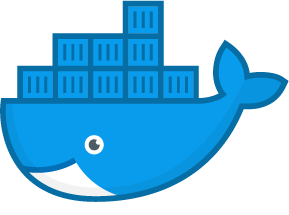
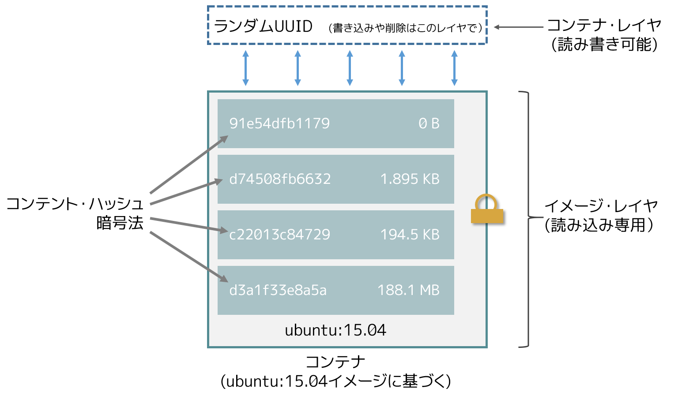
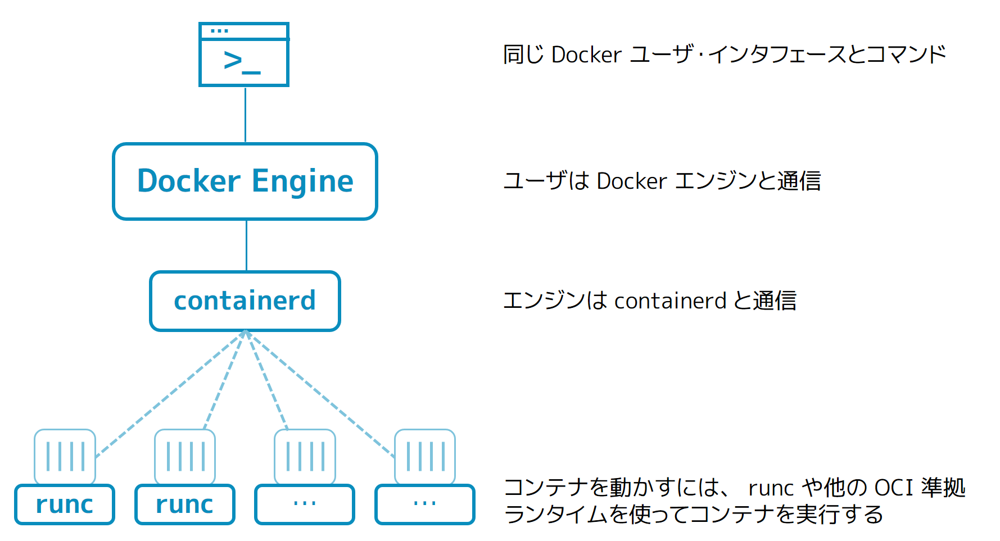
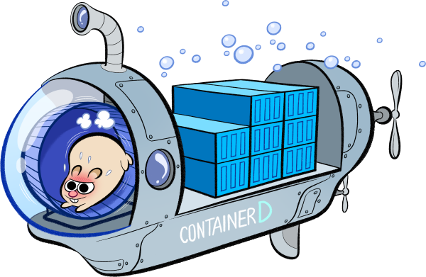

% コンテナ技術/CCS/ACCS   
% Shinya Yanagihara
% June-21-2017

# コンテナ技術  

---

### コンテナ型仮想化

---

### ファイルシステムの差分管理

---

### コンテナ技術の歴史

|#|Year|Name|
|--|--|--|
|1|1979|choot|
|2|2000|FreeBSD Jail|
|3|2005|Solaris Containers|
|4|2008|LXC|
|5|2014|Docker|

---

### chroot

ルートディレクトリを変更するシステムコール

---

### FreeBSD Jail

chroot を拡張し、ファイルシステムの名前空間以外も隔離
- プロセスリスト
- ネットワークスタック
ユースケース：root 権限の一般ユーザへの委譲

---

### Solaris Containers

---

### LXC (Linux Containers)

単一の Linux カーネルをプロセス毎に隔離し、複数の仮想サーバを制御する仮想環境

- namespaces (カーネルの名前空間)
- cgroups (コントロールグループ )

  

---

#### namespaces

|名前空間|隔離対象|
|---|---|
|Mount|ファイルシステム|
|UTS|ホスト名, NIS ドメイン名|
|IPC|プロセス間通信, POSIX メッセージキュー|
|PID|プロセスID, コンテナが違えば同一 ID 可|
|Network|ネットワークデバイス, IP アドレス, IP テーブル等|
|User|ユーザ (uid), グループ (group)|

---

#### cgroups

|サブシステム|機能概要|
|---|---|
|cpu|CPUのスケジューリングを制御 相対配分: CPU時間の割当を割合で指定 帯域制御: タスクが実行できる合計時間を制限|
|cpuacct|グループ内のタスクが消費するCPU時間をレポート|
|cpuset|グループへのCPU，メモリノードの割り当て|
|memory|グループ内のタスクが消費するメモリリソースのレポートと制限|
|blkio|ブロックデバイスに対する制限 重みづけ配分: I/Oアクセスの比率を割合で指定 帯域制限: 各デバイスに対して行える操作数の制限|
|devices|グループ内のタスクのデバイスへのアクセスの許可，禁止の指定|
|net_cls|グループ内のプロセスが発信するパケットの制御|
|net_prio|グループ内のタスクのネットワークの優先度の制御|
|freezer|	グループ内のプロセス全てを同時に一時停止・再開|

---

### Docker

- Docker <= 0.8 は LXC (や libvirt, systemd-nspawn) 経由で名前空間, cgroups 等を利用
- Docker >= 0.9 は libcontainer ドライバ経由でカーネルのコンテナAPIを直接コールするため、LXCがなくても稼働可能

**Docker Engine** で制御

  

---

#### Docker Engine アーキテクチャ

---

#### runC

- Docker のコアコンテナランタイム
- Docker >= 1.11 は、OCI 準拠の構成となり、Docker Engine っが **containerd** と通信し、containerd はランタイムとして、**runC** をす使用する

##### Open Containers Initiative
-  コンテナの標準仕様を議論・策定する標準化団体

##### runC
- オープン・コンテナ・ランタイム仕様に準拠するリファレンス実装
- runC のみでCLIとして機能しコンテナの起動が可能（デーモン不要）
- コンテナの実行レイヤのコアランタイム

  

---

#### containerd
- Docker のコアコンテナランタイム
- 実行中のコンテナの監視・管理
- コンテナイメージの管理（レジストリへのpush/pull）

# Container Cloud Service  

---

#### dockerd

- Docker >= 1.12 は、[docker daemon](https://docs.docker.com/v1.11/engine/reference/commandline/daemon/) が、[dockerd](https://docs.docker.com/engine/reference/commandline/dockerd/) に変更
- docker swarm との統合
- 1.11までは、クラスタ管理のために、Docker Engine とは別に Swarm マネージャ/Swarm ノードがj必要
- 1.12からは、dockerd がDocker Daemon の役割と、Swarm ノードの役割を担う

---

### Sub Slide

1. list
1. list

# Application Container Cloud Service  

---

### Sub Slide

1. list
1. list
